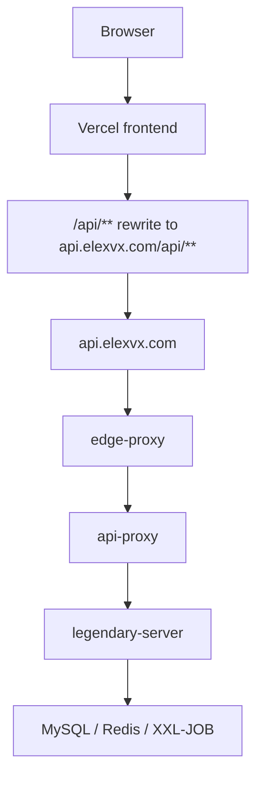

## Standard shape

- frontend hosted on Vercel
- backend hosted on a server with Docker Compose
- unified API entry through `edge-proxy` and `api-proxy`

## Deployment topology



## Core files

- `deploy/docker-compose.prod.yml`
- `deploy/.env`
- `deploy/nginx/*.conf`
- `scripts/deploy-container.mjs`

## Common commands

```bash
node scripts/deploy-container.mjs --rebuild
node scripts/deploy-container.mjs --ps
node scripts/deploy-container.mjs --logs
node scripts/deploy-container.mjs --stop
```

## Important note

Writable Docker volumes matter for uploads, plugin storage, and staging directories. Deployment automation should prepare permissions instead of relying on one-off manual fixes.
