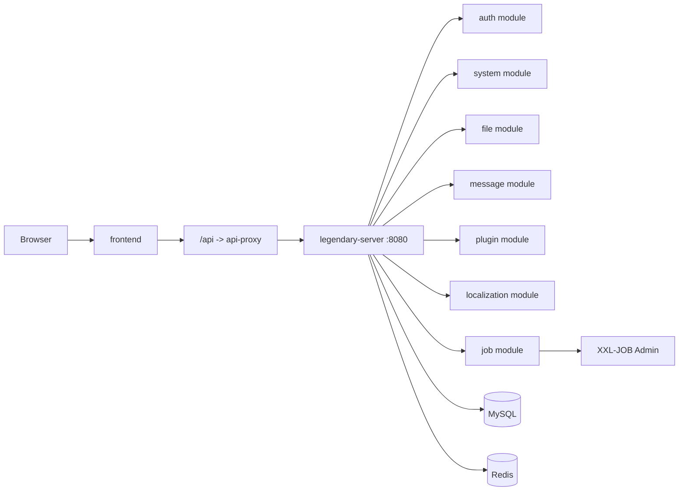

`legendary-invention` is an enterprise SaaS platform foundation. Its current production shape is a **modular monolith / monolithic microservice**:

- one backend runtime entry: `services/legendary-server`
- clear module boundaries kept in code
- a unified `/api` entry for the frontend

This docs set turns the repository's raw architecture notes into a cleaner onboarding tutorial.

## What you will find here

- `Quick Start`: local setup, core commands, repository orientation
- `Architecture`: runtime topology, backend boundaries, frontend structure, permission and data rules, Outbox events
- `Deployment`: Docker Compose deployment and operational checks

## Runtime topology

## Suggested reading order

1. [Local Setup](/en/docs/quick-start/local-setup)
2. [System Overview](/en/docs/architecture/system-overview)
3. [Backend Modules](/en/docs/architecture/backend-modules)
4. [Docker Deployment](/en/docs/deployment/docker-deployment)
