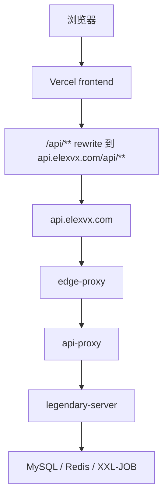

## 当前标准部署形态

前端与后端分离部署：

- 前端托管在 Vercel
- 后端运行在服务器 Docker Compose
- 统一对外 API 域名走 `api-proxy` 和 `edge-proxy`

这也是当前最应该默认采用的发布心智模型：前端是托管式静态或 SSR 交付，后端和基础设施集中在服务器容器编排里。

## 部署拓扑



## 默认启动组件

后端平台常见组件包括：

- `legendary-server`
- `api-proxy`
- `edge-proxy`
- `mysql`
- `redis`
- `legendary-xxl-job-admin`

按环境需要还可以补：

- `nacos`
- 观测栈（Prometheus / Loki / Tempo / Grafana）

## 核心部署目录

- `deploy/docker-compose.prod.yml`
- `deploy/.env`
- `deploy/nginx/*.conf`
- `scripts/deploy-container.mjs`

如果你只想知道“发布最先该看哪里”，就是这四个位置。

## 常用部署命令

完整重建：

```bash
node scripts/deploy-container.mjs --rebuild
```

只看状态：

```bash
node scripts/deploy-container.mjs --ps
```

看日志：

```bash
node scripts/deploy-container.mjs --logs
```

停止：

```bash
node scripts/deploy-container.mjs --stop
```

首次安装或换新机器时，建议优先使用安装器而不是直接手工拼 Compose：

```bash
node scripts/install-platform.mjs
```

只做环境检查：

```bash
node scripts/install-platform.mjs --check-only
```

无人值守部署可用：

```bash
node scripts/install-platform.mjs --yes
```

## 当前实践中的重要约束

- 正式后端核心容器是 `legendary-server`
- `api-proxy` 只是统一代理入口
- 默认不依赖本地 `git pull` 在服务器直接更新
- 更适合使用“本地打包归档 -> 上传服务器 -> 服务器部署脚本”发布

这一点很重要：不要把生产发布建立在“运维同学远程 SSH 上去手工修一遍”的习惯上。能放进脚本和配置的，都应该固化进脚本和配置。

## 环境变量

至少要正确配置：

- `DB_PASSWORD`
- `JWT_SECRET`
- `FIELD_SECRET`
- `PLUGIN_SIGNATURE_SECRET`
- `SAAS_JOB_INTERNAL_TOKEN`
- `CORS_ALLOWED_ORIGIN_PATTERNS`

真实环境里通常还要重点关注：

- `API_DOMAIN`
- `FRONTEND_ORIGIN`
- 数据库连接相关变量
- JVM、线程池、连接池、限流上限

## 典型部署流程

### 1. 本地准备

- 确认代码已经过最小构建检查
- 准备好部署归档或镜像
- 检查 `deploy/.env` 的核心变量

### 2. 服务器部署

```bash
node scripts/deploy-container.mjs --rebuild
```

### 3. 发布后检查

```bash
node scripts/check-deployment.mjs
```

应至少确认：

- 外部 `/health`
- `/api/health`
- `legendary-server` 本地健康检查
- 关键登录或公开配置接口

## Vercel 前端配置要点

前端默认通过 rewrite 把 `/api/**` 转到后端域名，例如：

```json
{
  "source": "/api/:path*",
  "destination": "https://api.elexvx.com/api/:path*"
}
```

这意味着前端代码里不应该到处散落真实后端地址。环境差异应该交给 rewrite、代理或环境变量处理。

## 小机器部署建议

如果服务器规格较小，例如 4C4G，建议遵守这些原则：

- 默认不启动前端容器，正式前端走 Vercel
- 默认不启动 Nacos，除非要演练未来拆分
- JVM、连接池、线程池、限流参数保守起步
- Redis 限制内存
- Docker 日志必须轮转

目标不是把机器压满，而是先守住稳定性边界。

## 上传目录权限

文件上传依赖 Docker 卷可写。当前部署脚本已经补上对应用写入卷的权限准备逻辑，确保 `legendary-server` 里的 `app` 用户可以写：

- 上传目录
- 插件目录
- 插件 staging 目录

这类基础设施权限问题，应该通过部署脚本固化，而不是靠线上临时手工修复。

## 备份与恢复建议

生产变更、插件升级、数据库迁移前，建议先执行平台备份。恢复动作则更适合先在测试环境演练，确认备份链路真实可用后再进入正式环境。

## 什么时候不要直接上线

- `deploy/.env` 里的核心密钥还没补齐
- 健康检查没通过
- 上传目录、插件目录权限不确定
- 还没跑过最小 smoke check
- 不清楚当前发布是否会覆盖已有数据
