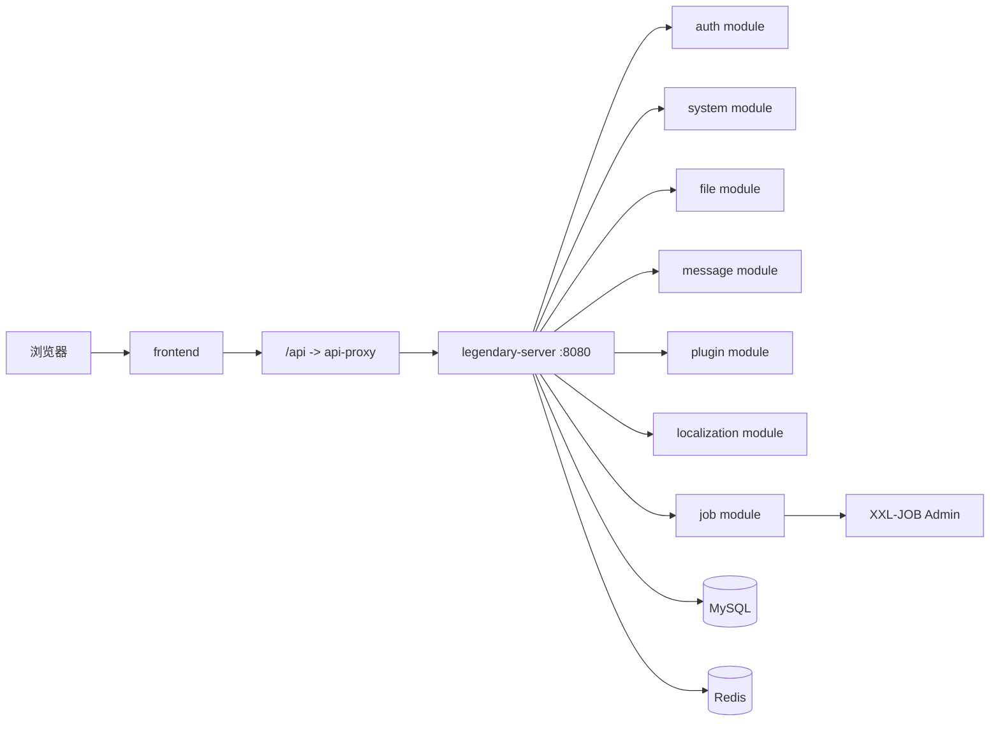

`legendary-invention` 是一套企业级 SaaS 平台底座。它现在的正式运行形态已经从“多进程纯微服务”收敛为“单体微服务”：

- 生产和本地默认只启动一个后端入口 `services/legendary-server`
- 代码仍然按 `auth-service`、`system-service`、`file-service`、`message-service` 等模块保持清晰边界
- 前端通过 `/api` 调用统一入口，避免直接绑定具体模块地址

这套文档不是把仓库里的设计草稿原样搬过来，而是把现在仍然有效、可以直接拿来开发和部署的知识整理成教程。你可以把它理解成三件事的结合：

- 新同学 onboarding 手册
- 当前架构的运行说明
- 面向发布与排障的操作文档

## 你会在这里看到什么

- `快速开始`：本地启动、开发环境、核心命令、目录结构和最短上手路径
- `架构设计`：系统拓扑、后端模块边界、前端分层、权限与数据边界、Outbox 事件
- `部署运维`：Docker Compose 部署方式、环境变量、发布检查、备份恢复和常见运维动作

## 当前运行拓扑

## 这套系统当前到底怎么理解

如果你第一次看这个仓库，最容易混淆的是“目录像微服务，运行又像单体”。正确理解方式是：

- 从运行角度看，它是一个后端聚合入口 `legendary-server`
- 从代码边界看，它仍然是模块化微服务设计
- 从部署角度看，它默认是前后端分离：Vercel 前端 + Docker Compose 后端
- 从演进角度看，它保留未来重新拆成物理微服务的可能性

也就是说，今天开发和运维都应该以“聚合运行”这条主线为准，但新增功能时仍然要按“模块 owner 清晰、表 owner 清晰、权限 owner 清晰”的方式落代码。

## 核心原则

- 一个运行入口，不等于一个混乱单体
- 模块 owner、数据 owner、权限 owner 必须明确
- 公共能力下沉到 `libs/*`，不要跨模块直接穿透实现
- 前端显隐不是安全边界，后端必须做真实鉴权
- 部署默认走 Docker Compose，前端与后端分离托管

## 你在阅读时要先记住的几个判断标准

### 1. 看“运行入口”时，以 `legendary-server` 为准

很多旧文档、旧目录、旧脚本里还会出现独立服务名称，但今天默认健康检查、容器编排、发布检查、日志观察，应该都围绕 `services/legendary-server` 进行。

### 2. 看“业务边界”时，以 `services/*-service` 为准

虽然只启动一个后端进程，但认证、系统、文件、消息、插件、本地化、任务这些模块仍然有清晰边界。后续如果重新拆分，就是沿着这些边界拆，而不是从零再设计一遍。

### 3. 看“跨模块协作”时，以契约和事件为准

跨模块不要因为“都在一个 JVM 里”就直接穿透别人的实现或表结构。优先考虑：

- 共享契约库
- 明确的应用服务接口
- Outbox 事件
- 统一的权限和上下文约定

### 4. 看“发布方式”时，以 `deploy/` 和 `scripts/` 为准

当前标准发布方式不是“进服务器后手工改几行再重启”，而是：

1. 本地完成构建与检查
2. 使用部署脚本准备镜像和归档
3. 服务器通过 Docker Compose 拉起后端平台
4. 用健康检查和轻量冒烟验证发布结果

## 适合谁读

- 新接手项目的后端、前端、运维同学
- 需要上线一套演示或准生产环境的实施人员
- 要在现有仓库里新增一个业务域、一个管理页面或一条异步链路的开发者
- 需要排查权限、上传、消息、知识库、代理等问题的维护者

## 建议阅读顺序

1. 先看 [本地启动与开发](/zh/docs/quick-start/local-setup)
2. 再看 [系统总览](/zh/docs/architecture/system-overview)
3. 如果要改业务模块，继续看 [后端模块边界](/zh/docs/architecture/backend-modules) 和 [前端架构](/zh/docs/architecture/frontend-architecture)
4. 如果要发布环境，最后看 [Docker 部署](/zh/docs/deployment/docker-deployment)

## 这套文档覆盖什么，不覆盖什么

这套文档重点覆盖：

- 当前仓库的真实运行方式
- 当前有效的目录职责和模块边界
- 权限、数据、事件、部署、运维这些会直接影响开发质量的约束
- 常见排障路径

这套文档不重点覆盖：

- 已经废弃的旧部署方式
- 纯概念式“理想微服务架构宣讲”
- 脱离当前代码上下文的通用教程
